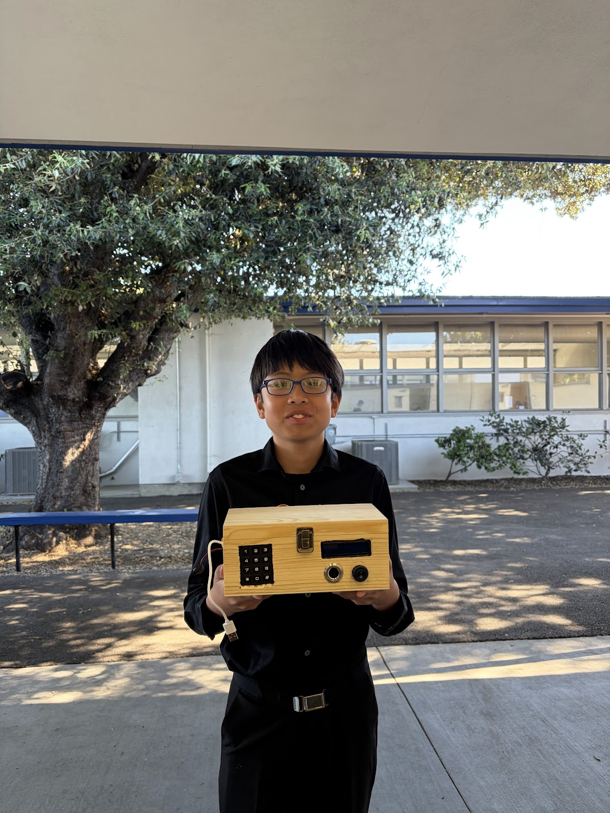
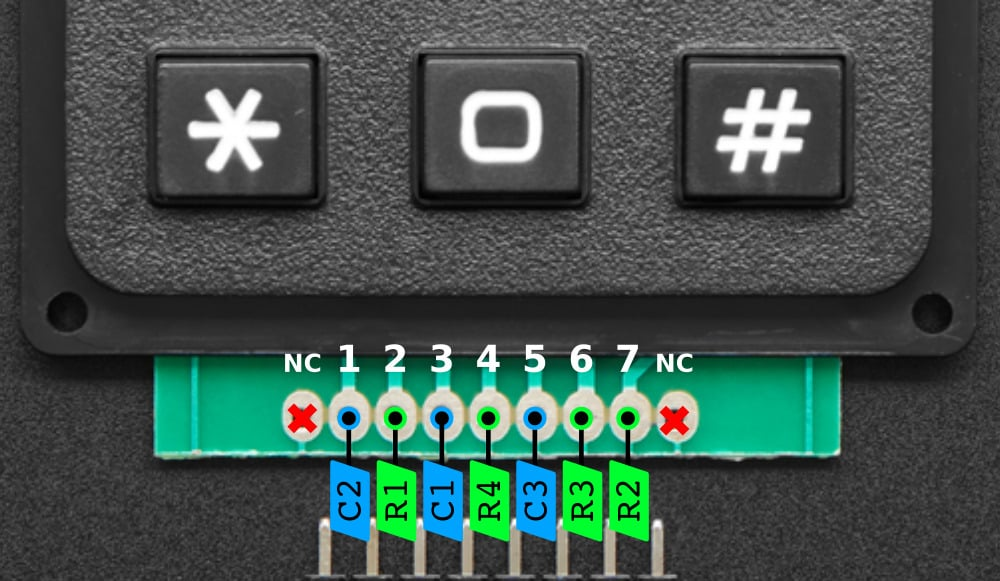
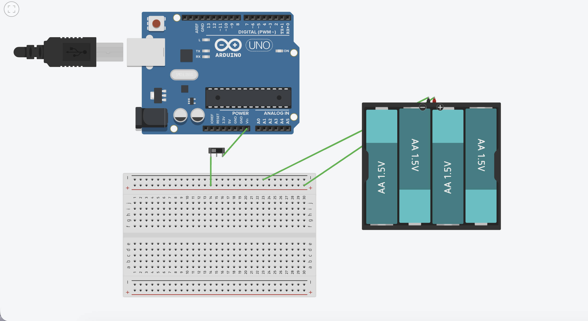
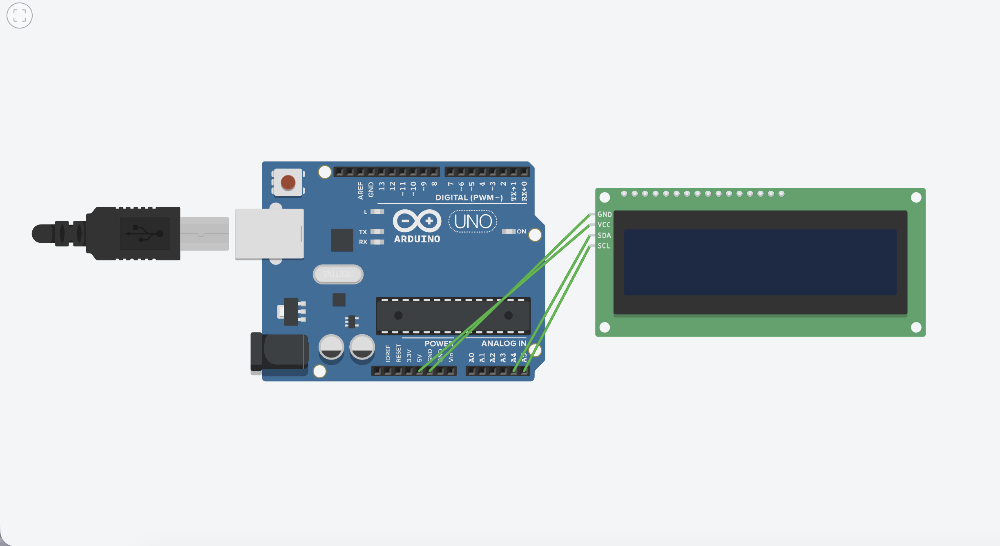
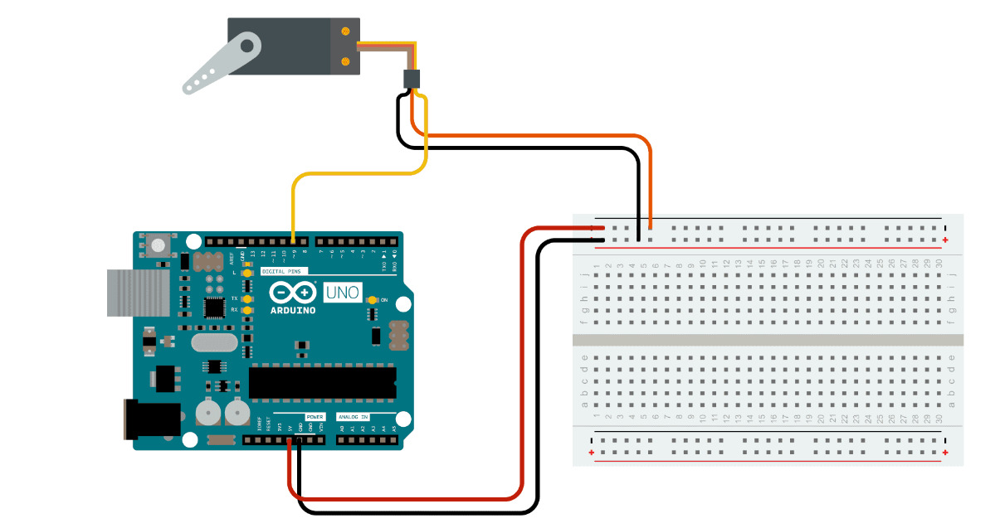

# BlueStamp Fingerprint ID Safe with Keypad
For my intensive project, I decided to build a lockbox to store my valuables. It features a password keypad, fingerprint sensor, and mobile app. There are two ways to unlock the safe: either correctly enter the password and scan your fingerprint on the lockbox console, or use the face ID feature on your phone to directly unlock the safe.

You should comment out all portions of your portfolio that you have not completed yet, as well as any instructions:
```HTML 
<!--- This is an HTML comment in Markdown -->
<!--- Anything between these symbols will not render on the published site -->
```

| **Engineer** | **School** | **Area of Interest** | **Grade** |
|:--:|:--:|:--:|:--:|
| William X | Irvington High School | Electrical Engineering | Incoming Sophomore

**Replace the BlueStamp logo below with an image of yourself and your completed project. Follow the guide [here](https://tomcam.github.io/least-github-pages/adding-images-github-pages-site.html) if you need help.**


  
# Final Milestone

<iframe width="560" height="315" src="https://www.youtube.com/embed/8KN960_h9_0" title="YouTube video player" frameborder="0" allow="accelerometer; autoplay; clipboard-write; encrypted-media; gyroscope; picture-in-picture; web-share" allowfullscreen></iframe>

For my final milestone, 

# Second Milestone

<iframe width="560" height="315" src="https://www.youtube.com/embed/YcQ7PkH5qnI" title="YouTube video player" frameborder="0" allow="accelerometer; autoplay; clipboard-write; encrypted-media; gyroscope; picture-in-picture; web-share" allowfullscreen></iframe>

For my second milestone, I wired up a servo motor to my Arduino and organized the wires a bit. However, as soon as I transferred everything over to the Arduino R4, my fingerprint sensor stopped working, which I spent two weeks trying to fix. After that, I synced the Arduino R4 with Blynk so that I could open the lockbox from my phone (in case something goes wrong with the fingerprint sensor). How the Blynk system works is, there's a button in the app that's connected to a datastream, essentially a variable, on the website. When you click the button once, it changes the value of the datastream from 0 to 1 and sends a message to the Arduino, allowing the servo to rotate. When you click it again, the value changes back to 0, prompting it to rotate back to its initial position. For my final milestone, I plan to fix any bugs that still exist, add a switch to turn the box on and off without being connected to my computer, and drill everything into the actual box.

# First Milestone

<iframe width="560" height="315" src="https://www.youtube.com/embed/g-cnZu8ZC8U" title="YouTube video player" frameborder="0" allow="accelerometer; autoplay; clipboard-write; encrypted-media; gyroscope; picture-in-picture; web-share" allowfullscreen></iframe>

For my first milestone, I wired up a keypad, fingerprint sensor, and lcd to an Arduino and coded it. The system starts off by asking you to enter the password. If you get the password wrong, you lose an attempt and have two more chances to get it right. If you run out of attempts, you are locked out until the safe turns off. If you get it correct, you are then prompted to scan your finger. If the system recognizes your fingerprint, then the safe unlocks. If it doesn't, you are asked to rescan your finger, and if you still get it wrong, you are locked out of the safe. The hardest part of creating this was probably getting my code to work and fixing any incorrect wirings. For my second milestone, I will likely wire up a servo motor that will physically open the safe and a button to save battery.

# Schematics 

<br>
**Figure 1 - Keypad Wiring**
<br>
<br>
<br>
<br>

<br>
**Figure 2 - Button Wiring**
<br>
<br>
<br>
<br>

<br>
**Figure 3 - LCD Wiring**
<br>
<br>
<br>
<br>

<br>
**Figure 4 - Servo Motor Wiring**

# Code 

```c++
#define BLYNK_TEMPLATE_ID "TMPL2Xyd2VK25" 
#define BLYNK_TEMPLATE_NAME "Lockbox App" 
#define BLYNK_AUTH_TOKEN "b2kzKvsd_BsLOTSZLCVM-jGbtlZcwPR3" 

#include <Wire.h> 
#include <LiquidCrystal_I2C.h> 
#include <WiFiS3.h> 
#include <BlynkSimpleWifi.h> 
#include "Adafruit_Keypad.h" 
#include <Adafruit_Fingerprint.h> 

#define KEYPAD_PID3845 
#define R2 4 
#define R3 5
#define C3 6 
#define R4 7 
#define C1 8 
#define R1 9 
#define C2 10 
#include "keypad_config.h" 

const int fin = 13; 
const int SERVO_PIN = 11; 
int state = 0; 

Adafruit_Keypad customKeypad = Adafruit_Keypad(makeKeymap(keys), rowPins, colPins, ROWS, COLS); 
LiquidCrystal_I2C lcd(0x27, 16, 2); 
Adafruit_Fingerprint finger = Adafruit_Fingerprint(&Serial1); 

char auth[] = BLYNK_AUTH_TOKEN; 
char ssid[] = "J11"; 
char pass[] = "Blue@J11";
String pwd = ""; 
bool start_pressed = false; 
bool password_authenticated = false; 
bool is_open = false; 
bool blynk_action_triggered = false; 
int attempts_left = 3; 
int finger_attempts_left = 2; 
bool step1_authenticated = false; 

void reset(); 

void physical_open() { 
  if (!is_open) { 
    Serial.println("Driving Servo safely to OPEN (45 degrees)..."); 
    for (int i = 0; i < 20; i++) { 
      digitalWrite(SERVO_PIN, HIGH); 
      delayMicroseconds(1000); 
      digitalWrite(SERVO_PIN, LOW); 
      delay(20); 
    } 
    is_open = true; 
    lcd.clear(); 
    lcd.print("Box Open. To Lock"); 
  } 
} 

void physical_close() { 
  if (is_open) { 
    Serial.println("Driving Servo safely to CLOSED (135 degrees)..."); 
    for (int i = 0; i < 20; i++) { 
      digitalWrite(SERVO_PIN, HIGH); 
      delayMicroseconds(2000); 
      digitalWrite(SERVO_PIN, LOW); 
      delay(20); 
    } 
    digitalWrite(SERVO_PIN, LOW); 
    is_open = false; 
    lcd.clear(); 
    lcd.print("Lockbox Closed"); 
  } 
} 

BLYNK_CONNECTED() { 
  Blynk.virtualWrite(V1, 0); 
  Serial.println("System started: Blynk switch forced to 0."); 
} 

BLYNK_WRITE(V1) { 
  int switchState = param.asInt(); 
  if (!step1_authenticated && !is_open) { 
    if (switchState == 1) { 
      Serial.println("Blynk Auth: Step 1 approved via app. Enter passcode."); 
      blynk_action_triggered = true; 
      step1_authenticated = true; 
      start_pressed = true; 
      pwd = ""; 
      lcd.clear(); 
      lcd.print("Enter Password:"); 
    } 
    return; 
  } 
  if (is_open && switchState == 0) { 
    Serial.println("Blynk App Action: Close requested via phone switch."); 
    physical_close(); 
    reset(); 
  } 
} 

void setup() { 
  Serial.begin(115200); 
  delay(500); 
  Serial.println("---SYSTEM STARTING---"); 
  pinMode(SERVO_PIN, OUTPUT); 
  pinMode(fin, INPUT); 
  for (int i = 0; i < 15; i++) { 
    digitalWrite(SERVO_PIN, HIGH); 
    delayMicroseconds(2000); 
    digitalWrite(SERVO_PIN, LOW); 
    delay(20); 
  } 
  digitalWrite(SERVO_PIN, LOW); 
  is_open = false; 
  Wire.begin(); 
  Wire.setClock(100000); 
  delay(100); 
  lcd.init(); 
  lcd.backlight(); 
  lcd.clear(); 
  lcd.print("Starting Up..."); 
  customKeypad.begin(); 
  Blynk.begin(auth, ssid, pass); 
  delay(200); 
  reset(); 
} 

void loop() { 
  Blynk.run(); 
  customKeypad.tick(); 
  state = digitalRead(fin); 
  if (state == HIGH) { 
    Serial.println("Fingerprint Status: 1 (SUCCESS)"); 
  } else { 
    Serial.println("Fingerprint Status: 0 (NO MATCH)"); 
  } 
  if (!step1_authenticated && !is_open) { 
    while (customKeypad.available()) { 
      keypadEvent e = customKeypad.read(); 
      if (e.bit.EVENT == KEY_JUST_PRESSED && (char)e.bit.KEY == '*') { 
        if (state == HIGH) { 
          Serial.println("Fingerprint Verified via Pin 13."); 
          step1_authenticated = true; 
          start_pressed = true; 
          pwd = ""; 
          lcd.clear(); 
          lcd.print("Enter Password:"); 
        } else { 
          finger_attempts_left--; 
          Serial.print("Fingerprint Match Failed. Attempts left: "); 
          Serial.println(finger_attempts_left); 
          lcd.clear(); 
          lcd.print("No Match Found"); 
          lcd.setCursor(0, 1); 
          lcd.print("Attempts Left: "); 
          lcd.print(finger_attempts_left); 
          delay(2000); 
          if (finger_attempts_left <= 0) { 
            Blynk.virtualWrite(V1, 0); 
            permanently_locked(); 
          } else { 
            reset(); 
          } 
        } 
      } 
    } 
  } 
  if (step1_authenticated && !is_open) { 
    while (customKeypad.available()) { 
      keypadEvent e = customKeypad.read(); 
      if (e.bit.EVENT == KEY_JUST_PRESSED) { 
        char cur = (char)e.bit.KEY; 
        if (cur == '*') { 
          pwd = ""; 
          lcd.clear(); 
          lcd.print("Enter Password:"); 
        } else if (start_pressed && cur != '#') { 
          pwd += cur; 
          lcd.setCursor(pwd.length() - 1, 1); 
          pwd += ""; 
          lcd.print("*"); 
          if (pwd.length() == 4) { 
            checkPassword(); 
          } 
        } 
      } 
    } 
  } 
  if (is_open) { 
    while (customKeypad.available()) { 
      keypadEvent ke = customKeypad.read(); 
      if ((ke.bit.EVENT == KEY_JUST_PRESSED) && ((char)ke.bit.KEY == '#')) { 
        Serial.println("Lock box requested via physical Keypad."); 
        physical_close(); 
        Blynk.virtualWrite(V1, 0); 
        delay(500); 
        reset(); 
      } 
    } 
  } 
  delay(10); 
} 

void checkPassword() { 
  lcd.clear(); 
  lcd.setCursor(0, 0); 
  if (pwd == "1234") { 
    attempts_left = 3; 
    finger_attempts_left = 2; 
    lcd.print("Password"); 
    lcd.setCursor(0, 1);
    lcd.print("Accepted");
    Serial.println("Password accepted."); 
    delay(1000); 
    physical_open(); 
    lcd.clear();
    lcd.print("Press # or Use"); 
    lcd.setCursor(0, 1);
    lcd.print("App to Close");
  } else { 
    attempts_left--; 
    lcd.print("Access Denied"); 
    lcd.setCursor(0, 1); 
    lcd.print("Attempts Left: "); 
    lcd.print(attempts_left); 
    delay(2000); 
    if (attempts_left <= 0) { 
      Blynk.virtualWrite(V1, 0); 
      permanently_locked(); 
    } else { 
      pwd = ""; 
      lcd.clear(); 
      lcd.print("Enter Password:"); 
    } 
  } 
} 

void reset() { 
  pwd = ""; 
  start_pressed = false; 
  password_authenticated = false; 
  blynk_action_triggered = false; 
  step1_authenticated = false; 
  lcd.clear(); 
  lcd.print("Scan Finger or"); 
  lcd.setCursor(0, 1); 
  lcd.print("Use App to Open"); 
} 

void permanently_locked() { 
  lcd.clear(); 
  lcd.print("SYSTEM LOCKED"); 
  while(true); 
}
```

# Bill of Materials 

| **Part** | **Note** | **Price** | **Link** |
|:--:|:--:|:--:|:--:|
| Arduino Uno R3 | Used to relay code to the fingerprint sensor and Uno R4 | $20.70 | <a href="https://www.amazon.com/Arduino-A000066-ARDUINO-UNO-R3/dp/B008GRTSV6/"> Link </a> |
| Arduino Uno R4 | Used to relay code to the R3 and the rest of the system | $27.50 | <a href="https://www.amazon.com/Arduino-UNO-WiFi-ABX00087-Bluetooth/dp/B0C8V88Z9D/"> Link </a> |
| Breadboard | Used to wire devices to the Arduinos | $8.99 | <a href="https://www.amazon.com/EL-CP-003-Breadboard-Solderless-Distribution-Connecting/dp/B01EV6LJ7G/"> Link </a> |
| Keypad | Used to input the password | $6.50 | <a href="https://www.adafruit.com/product/3845?srsltid=AfmBOop0mFDCKUcpbJfNziJJQCqdIGndAFKcya28DPK7Vt_bTC7mqKFMPDg"> Link </a> |
| Fingerprint Sensor | Used to scan user's fingerprint | €36,19 | <a href="https://www.amazon.com.be/-/en/Fingerprint-Identification-Capacitive-Recognition-Assistance/dp/B08GKY4RK1?language=en_GB"> Link </a> |
| Liquid Crystal Display Screen | Used to display messages outputted from the code | $12.99 | <a href="https://www.amazon.com/Hosyond-Display-Module-Arduino-Raspberry/dp/B0BWTFN9WF/"> Link </a> |
| Servo Motor | Used to open the lockbox | $13.98 | <a href="https://www.amazon.com/Deegoo-FPV-Servo-MG995-Metal-Gear/dp/B07NQJ1VZ2/"> Link </a> |
| Switch | Used to turn the lockbox on and off | $6.39 | <a href="https://www.amazon.com/DaierTek-Listed-Switches-Automotive-KCD1-5Pack/dp/B07S1MV462/"> Link </a> |
| 9V Battery | Used to power the R3 | $3.95 | <a href="https://www.amazon.com/PKCELL-9V-Batteries-Battery-Detector/dp/B010N044YY/"> Link </a> |
| Power Bank | Used to power the R4 | $6.49 | <a href="https://www.amazon.com/Miady-5000mAh-Portable-Charger-Android/dp/B08T8TDS8S/"> Link </a> |

# Starter Project

<iframe width="560" height="315" src="https://www.youtube.com/embed/x7NOztviujc" title="YouTube video player" frameborder="0" allow="accelerometer; autoplay; clipboard-write; encrypted-media; gyroscope; picture-in-picture; web-share" allowfullscreen></iframe>

For my starter project, I decided to choose the Retro Arcade Console. It features four different game modes that you can play: Tetris, Snake, Racing, and Slot. The hardest part of completing this project for me was soldering because some of the holes were really small, making it easy to create an accidental short circuit.
